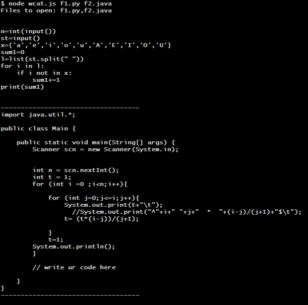
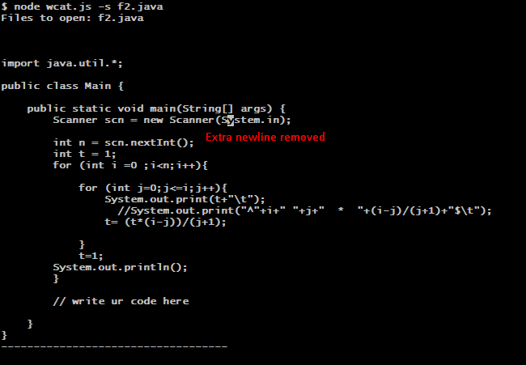
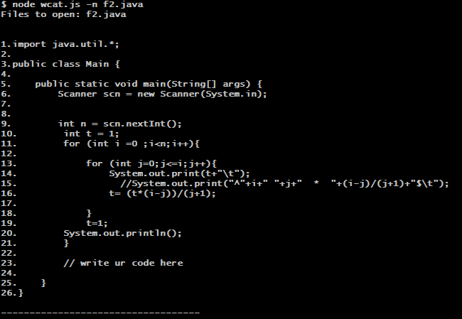

# wcat command (TERMINAL FILE VIEWER)

## This is the immplementation of the clone of cat command in linux to view file(s) into the terminal, using javascript.

## Use:
> node wcat.js [OPTIONS] [FILEPATH]

## To view Multiples File:
> node wcat.js [FILEPATH1] [FILEPATH2]

## Flag Options:

### -s => View the files by removing multiple new lines

### -n => View the files by adding numbers before each line.

### -b => View the files by adding numbers before each non-empty line.

## Note: flags can be used in combination.

## SCREENTSHOTS:

